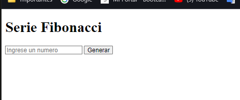
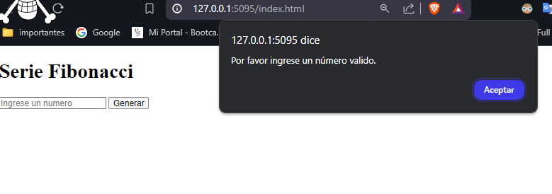
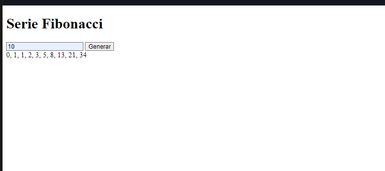

# Serie Fibonacci

Este proyecto es una aplicación web que genera la serie de Fibonacci basada en un número ingresado por el usuario. La aplicación solicita al usuario un número, verifica si es válido y luego muestra la serie de Fibonacci hasta el número especificado.

## Características

- Solicitamos al usuario un número por medio de un input.
- Verificamos si la entrada del usuario es un número válido.
- Generamos y muestra la serie de Fibonacci basada en el número ingresado.
- Mostramos el resultado tanto en el DOM como en la consola del navegador.

## Uso

1. Clona este repositorio en tu máquina local:
    ```sh
    git clone https://github.com/tuusuario/fibonacci-generator.git
    ```
2. Navega al directorio del proyecto:
    ```sh
    cd fibonacci-generator
    ```
3. Abre el archivo `index.html` en tu navegador preferido.




